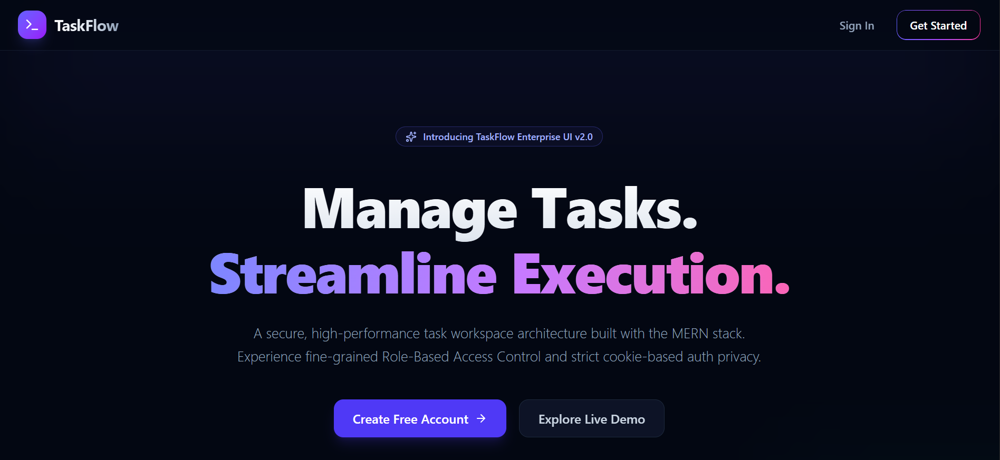

# 🚀 Task Management System

A full-stack Task Management System built using the MERN Stack with JWT Authentication, Role-Based Access Control (RBAC), CRUD Operations, Swagger Documentation, and a modern React frontend.

---

## 📑 Table of Contents

- [📌 Project Overview](#-project-overview)
- [✨ Features](#-features)
- [🛠 Tech Stack](#-tech-stack)
- [🏗 Architecture](#-architecture)
- [📂 Folder Structure](#-folder-structure)
- [🔗 API Endpoints](#-api-endpoints)
- [🔐 Authentication & Authorization](#-authentication--authorization)
- [⚙ Installation & Setup](#-installation--setup)
- [🔑 Environment Variables](#-environment-variables)
- [📖 Swagger Documentation](#-swagger-documentation)
- [📈 Scalability Considerations](#-scalability-considerations)
- [🚀 Future Enhancements](#-future-enhancements)
- [📸 Screenshots](#-screenshots)

---

## 📌 Project Overview

This project was developed as part of a Backend Developer Internship Assessment.

The application allows users to securely manage tasks while implementing industry-standard backend practices such as:

- JWT Authentication
- Password Hashing
- Role-Based Access Control
- Secure Cookie-Based Authentication
- CRUD Operations
- API Versioning
- Swagger Documentation
- Scalable Project Structure

---

## ✨ Features

### Authentication

- User Registration
- User Login
- User Logout
- Get Current User
- JWT Authentication
- HttpOnly Cookie-Based Authentication
- Password Hashing using bcryptjs

### Authorization

- User Role
- Admin Role
- Role-Based Access Control (RBAC)

### Task Management

- Create Task
- View Tasks
- Update Tasks
- Delete Tasks

### Admin Features

- View All Tasks
- Manage Tasks Across Users
- Role-Based Dashboard

### Frontend

- Responsive Landing Page
- Login Page
- Registration Page
- User Dashboard
- Admin Dashboard

### Documentation

- Swagger Documentation
- RESTful API Design

---

## 🛠 Tech Stack

### Frontend

- React.js
- Vite
- Tailwind CSS
- React Router DOM
- Axios

### Backend

- Node.js
- Express.js

### Database

- MongoDB
- Mongoose

### Authentication

- JWT
- bcryptjs
- cookie-parser

### Documentation

- Swagger UI
- Swagger JSDoc

---

## 🏗 Architecture

```text
Frontend (React)
        │
        ▼
REST API (Express.js)
        │
        ▼
Authentication Middleware
        │
        ▼
Controllers
        │
        ▼
Services
        │
        ▼
MongoDB Database
```

---

## 📂 Folder Structure

```text
task-management-system
│
├── backend
│   ├── src
│   │   ├── controllers
│   │   ├── middleware
│   │   ├── models
│   │   ├── routes
│   │   ├── services
│   │   ├── validators
│   │   ├── docs
│   │   ├── app.js
│   │   └── server.js
│   │
│   ├── package.json
│   └── .env
│
├── frontend
│   ├── src
│   │   ├── api
│   │   ├── components
│   │   ├── context
│   │   ├── pages
│   │   ├── routes
│   │   └── App.jsx
│   │
│   ├── package.json
│   └── .env
│
└── README.md
```

---

## 🔗 API Endpoints

### Authentication APIs

| Method | Endpoint | Description |
|---------|----------|-------------|
| POST | `/api/v1/auth/register` | Register User |
| POST | `/api/v1/auth/login` | Login User |
| GET | `/api/v1/auth/me` | Get Current User |
| POST | `/api/v1/auth/logout` | Logout User |

### Task APIs

| Method | Endpoint | Description |
|---------|----------|-------------|
| POST | `/api/v1/tasks` | Create Task |
| GET | `/api/v1/tasks` | Get All Tasks |
| GET | `/api/v1/tasks/:id` | Get Single Task |
| PUT | `/api/v1/tasks/:id` | Update Task |
| DELETE | `/api/v1/tasks/:id` | Delete Task |

---

## 🔐 Authentication & Authorization

### JWT Authentication

Authentication is implemented using JSON Web Tokens (JWT).

The JWT token is stored inside an HttpOnly Cookie to improve security and protect against XSS attacks.

### Role-Based Access Control

#### User

- Create Tasks
- View Own Tasks
- Update Own Tasks
- Delete Own Tasks

#### Admin

- View All Tasks
- Manage Tasks Across Users
- Administrative Controls

---

## ⚙ Installation & Setup

### Clone Repository

```bash
git clone  https://github.com/PurvaNijai34/task-management-system.git
```

### Backend Setup

```bash
cd backend
npm install
npm run dev
```

### Frontend Setup

```bash
cd frontend
npm install
npm run dev
```

---

## 🔑 Environment Variables

### Backend (.env)

```env
PORT=5000

MONGO_URI=your_mongodb_connection_string

JWT_SECRET=your_secret_key

CLIENT_URL=http://localhost:5173
```

### Frontend (.env)

```env
VITE_API_URL=http://localhost:5000/api/v1
```

---

## 📖 Swagger Documentation

After starting the backend server:

```text
http://localhost:5000/api-docs
```

Swagger provides interactive API documentation for testing and exploring endpoints.

---

## 📈 Scalability Considerations

This project follows scalable backend design principles:

- API Versioning (`/api/v1`)
- Modular Folder Structure
- Service Layer Architecture
- Middleware-Based Authentication
- Role-Based Authorization
- Validation Layer
- Global Error Handling

Future scalability improvements may include:

- Redis Caching
- Rate Limiting
- Docker Containerization
- Load Balancing
- Microservices Architecture
- CI/CD Pipelines

---

## 🚀 Future Enhancements

- Email Verification
- Password Reset Functionality
- Task Filtering
- Task Search
- Task Priorities
- Activity Logs
- Real-Time Notifications
- Team Collaboration

---

## 📸 Screenshots

### Landing Page



### Login Page

_Add Screenshot Here_

### User Dashboard

_Add Screenshot Here_

### Admin Dashboard

_Add Screenshot Here_

### Swagger Documentation

_Add Screenshot Here_

---

## 👨‍💻 Author

**Purva Nijai**

Backend Developer Internship Assessment Project
